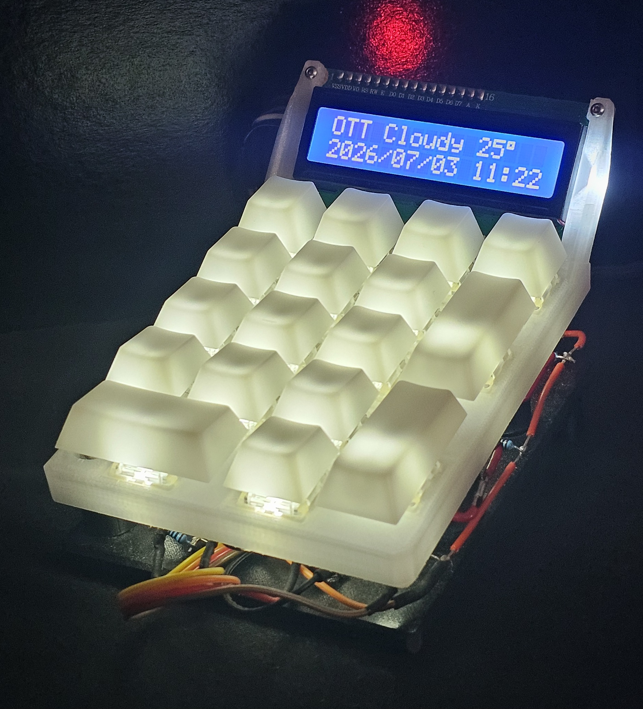
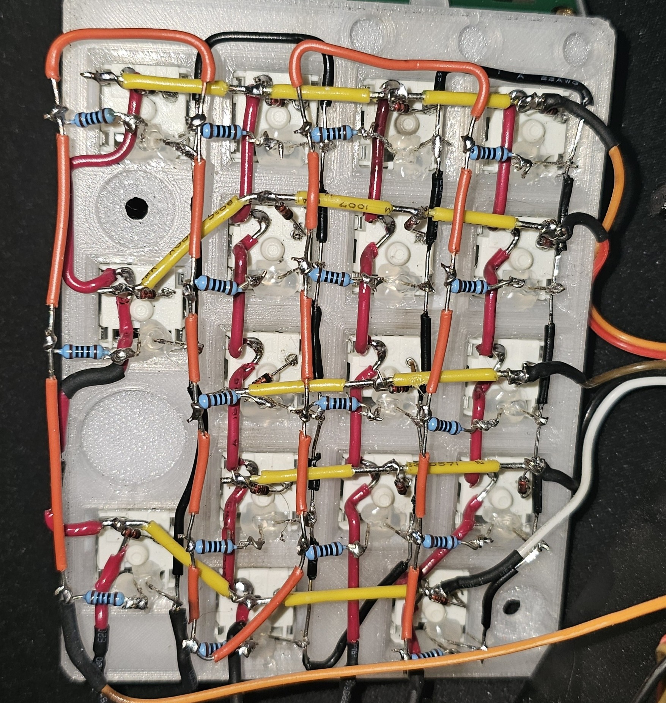

# pico-numpad

Hand-wired 17-key USB numpad on a Raspberry Pi Pico W. CircuitPython,
diode-per-key 5x4 matrix, event-driven scanning via `keypad.KeyMatrix`.

  <table align="center">
    <tr>
      <td align="center" width="450" valign="top">
         
        <b>Finished Device</b>
      </td>
      <td align="center" width="470" valign="top">
         
        <b>Hand-Wired Matrix</b>
      </td>
    </tr>
  </table>

## Features

- USB HID numeric keypad
- Event-driven matrix scanning (`keypad.KeyMatrix`)
- 16x2 LCD with switchable views:
  - Clock + weather (current conditions and local time for one of
    four preset Canadian locations; date + time synced from the host)
  - PC stats, 4 cycling pages: overview (CPU/GPU utilization,
    temperature, package power), memory (RAM utilization, DIMM
    temperatures, VRAM), clocks (P/E-core max, GPU, TjMax
    distance), and voltages
  - Calculator (+ - * / with standard precedence; expression on
    row 0, result on Enter; keys are captured while active and
    send nothing to the PC)
  - Lifetime keypress statistics
- NumLock doubles as a momentary Fn key:
  - Fn+0: Clock view; pressed again while on it, cycles the
    weather location
  - Fn+1: PC stats view; pressed again while on it, cycles the
    stat pages
  - Fn+2: Calculator view; pressed again while on it, clears
  - Fn+3: Statistics view
  - Fn+'+': Increase keypad LED brightness
  - Fn+'-': Decrease keypad LED brightness
- Persistent lifetime key counter and LED brightness stored in onboard flash
- Adjustable keypad LED brightness (Fn + '+' / Fn + '-'), persisted across power cycles
- Automatic LCD backlight/LED timeout after 300 seconds of inactivity
- Optional host companion script feeding local time, hardware stats,
  and Environment Canada weather (extensible key:value serial
  protocol)

### LED behavior

- LED brightness is adjustable in 12.5% increments using Fn + '+' and Fn + '-'.
- Brightness is remembered across power cycles.
- The LED turns off together with the LCD backlight after the inactivity timeout and is restored to the saved brightness when activity resumes.

## Hardware

- Raspberry Pi Pico W (RP2040), CircuitPython 9.2.1
- 5x4 hand-wired matrix, one diode per key (anode toward row,
  cathode toward column, verified with `tools/diode_test.py`)
- Rows: GP2–GP6 · Columns: GP12–GP15 · Status LED: GP11
- Unwired matrix positions: (2,3), (3,3), (4,1)
- 16x2 character LCD on a PCF8574 I²C backpack, address 0x27
  (SCL GP1, SDA GP0)

## Install

1. Flash CircuitPython 9.x to the Pico.
2. Copy `code.py`, `boot.py`, and `lib/` to the CIRCUITPY drive,
   then power cycle (`boot.py` changes only apply at power-up).
   - On first boot, the firmware creates `/count.txt` to store persistent settings (currently the lifetime keypress count and LED brightness).
3. Install `adafruit_hid` from the
   [CircuitPython 9.x library bundle](https://circuitpython.org/libraries)
   into `lib/`.
4. Optional, for the clock, weather, and PC stats:
   `pip install pyserial requests env_canada` on the PC and run
   `python host/companion.py`. The pad is fully functional without
   it; the clock shows UNKNOWN, weather shows "no weather", and PC
   stats show "no data" until first contact.
   - The Pico exposes two serial ports; the script auto-detects
     the data port, or set PORT in the script manually.
   - PC stats additionally require
     [LibreHardwareMonitor](https://github.com/LibreHardwareMonitor/LibreHardwareMonitor)
     running as administrator with its web server enabled
     (Options → Remote Web Server → Run). Time and weather work
     without it.
   - Weather locations are configured in companion.py as
     label + coordinates + IANA timezone.
   - For hands-off startup, run both at logon: LibreHardwareMonitor
     via its own startup option, and companion.py via Task Scheduler
     (`pythonw.exe <path>\companion.py`).

## Design

Matrix scanning and debouncing run in C in the background
(`keypad.KeyMatrix`, 10 ms interval); the main loop only consumes
queued edge events, so a busy loop delays input rather than dropping
it. HID output uses `press()`/`release()` on edges so the host sees
real held keys and handles auto-repeat. A hand-written equivalent of
the scanner (polling, per-key debounce state machine) is kept in
[`reference/`](reference/) with a comparison of the two approaches.

`columns_to_anodes=False` is required for this board's diode
orientation; the default silently reads all keys as dead.

`boot.py` remounts the filesystem to allow the firmware to save the
persistent key counter. Holding **NumLock** while connecting the Pico
starts a development mode that leaves the drive writable from the host
and disables persistence.

The LCD is driven with no `sleep()` in the main loop: dirty-flag
rendering (I²C writes only on state change), fixed-width line
overwrites instead of `clear()`, and edge-triggered backlight
control. A full LCD line write costs ~50 ms over I²C, so
unconditional redraws would starve input latency.

The LCD is organized as switchable views (splash on boot, clock,
PC stats, calculator, statistics). Holding **NumLock** acts as a
momentary Fn key: tapping a digit while held switches views without
typing it. A plain NumLock tap is deferred until release so tap and
hold can be distinguished without affecting normal typing. Each view
owns its input: most pass keys through to the PC as normal typing,
while the calculator captures digits and operators entirely
(including suppressing their release events), so nothing leaks to
the host while it is active.

The calculator stores the expression as typed (row 0, scrolling
left past 16 characters) and evaluates on Enter with standard
precedence: tokens are reduced in two passes, folding `*` and `/`
left-to-right first, then summing the remaining `+`/`-` terms.
Divide-by-zero shows Error, cleared by the next digit. After a
result, a digit starts a fresh expression and an operator continues
from the result. Results too wide for the row use scientific
notation. Leaving the view clears it.

Time, weather, and PC stats come from an optional host script
(`host/companion.py`) over a second USB CDC serial port enabled in
`boot.py`. The protocol is newline-terminated ASCII `key:value` lines;
the Pico is a pure listener and the host broadcasts unsolicited (time
on connect and every 30 s, stats every 2 s, weather every 10 min).
The clock free-runs on the crystal between syncs and re-anchors on
every message, bounding drift to one broadcast interval. The RP2040
has no battery-backed RTC, so time is lost at power-off and shows
UNKNOWN until the first sync.

Weather comes from Environment Canada via the `env_canada` package
(nearest site to each configured coordinate). The clock view shows
one location's conditions on row 0 and its local date/time on row 1;
the host sends each location's UTC-offset delta computed fresh with
`zoneinfo`, so DST is handled entirely host-side. Weather older than
30 minutes displays as stale (`LABEL --`); PC stats older than 15
seconds display as "no data".

PC stat rows are composed entirely on the host: companion.py reads
LibreHardwareMonitor's JSON endpoint, selects sensors by hardware
prefix and display name (numeric sensor indices shift between LHM
versions), and sends each page row as a finished 16-character line.
The Pico renders these verbatim — apart from substituting `*` with
the LCD's degree symbol — so adding or reworking a stat page is a
host-only change. Missing sensors render as `--`; the sensor names
target this machine's hardware and need adjusting for others.

Persistent settings (currently the lifetime keypress count and LED brightness) 
are stored in `/count.txt`. To minimize flash wear, writes are batched 
(100 keypresses by default) and also occur immediately after brightness 
changes and when the device transitions to the idle state.

## Tools

- `tools/matrix_map_test.py` prints (row, col) per keypress; used
  to build/verify the keymap
- `tools/diode_test.py` is a bidirectional scan; verifies diode
  presence and orientation per key

Run either by copying to CIRCUITPY as `code.py` (back up first) and
watching the serial console. Run in dev mode (NumLock at plug-in)
so the drive is writable.

## Credits

LCD driver (`lib/lcd.py`, `lib/i2c_pcf8574_interface.py`):
[dwhall/circuitpython_lcd](https://github.com/dwhall/circuitpython_lcd),
original license headers retained.